# SIPERAN Kedungwaringin - Diagram Workflow & Alur Proses

## 1. Sistem Overview

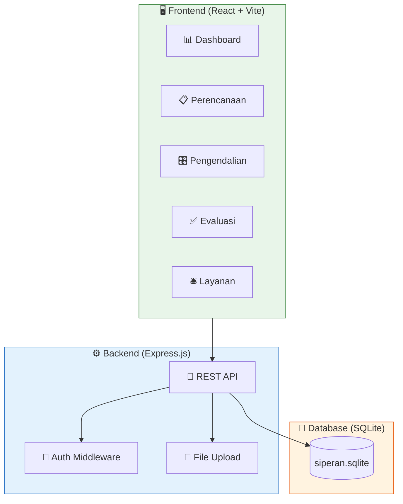

## 2. User Role & Access Control

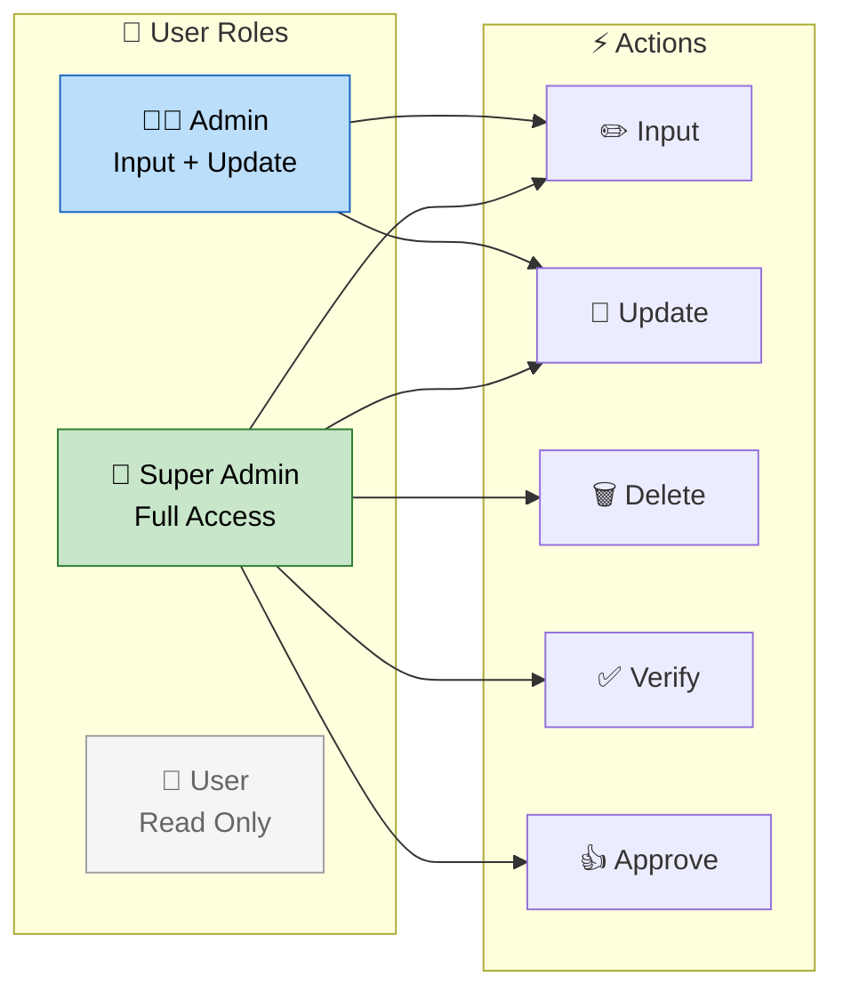

### Tabel Hak Akses

| Fitur | Super Admin | Admin | User |
|:------|:-----------:|:-----:|:----:|
| Dashboard | ✅ | ✅ | ✅ |
| Input Data | ✅ | ✅ | ❌ |
| Update Data | ✅ | ✅ | ❌ |
| Delete Data | ✅ | ❌ | ❌ |
| Verifikasi | ✅ | ❌ | ❌ |
| Approve | ✅ | ❌ | ❌ |
| Manajemen User | ✅ | ❌ | ❌ |

## 3. Siklus Kinerja Kecamatan

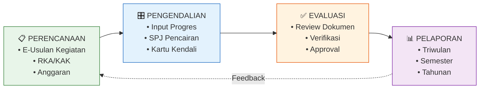

## 4. Workflow Input RKA

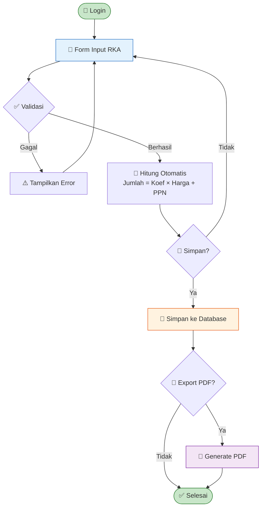

### Form Input RKA

```mermaid
block-beta
    columns 9
    KODE["KODE REKENING"]:1
    URAIAN["URAIAN"]:2
    KOEF["KOEFISIEN"]:1
    SATUAN["SATUAN"]:1
    HARGA["HARGA SATUAN"]:1
    PPN["PPN %"]:1
    JUMLAH["JUMLAH"]:1
    AKSI["AKSI"]:1

    block:row1["Header Row"]:9
    row1 --> KODE
    row1 --> URAIAN
    row1 --> KOEF
    row1 --> SATUAN
    row1 --> HARGA
    row1 --> PPN
    row1 --> JUMLAH
    row1 --> AKSI
```

## 5. Workflow Pengendalian & Realisasi

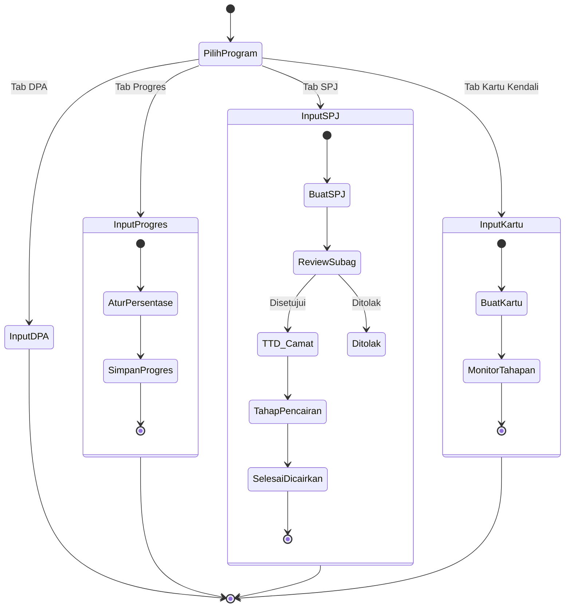

### Status Verifikasi SPJ

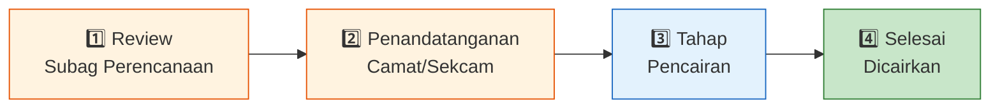

## 6. Workflow Evaluasi & Verifikasi

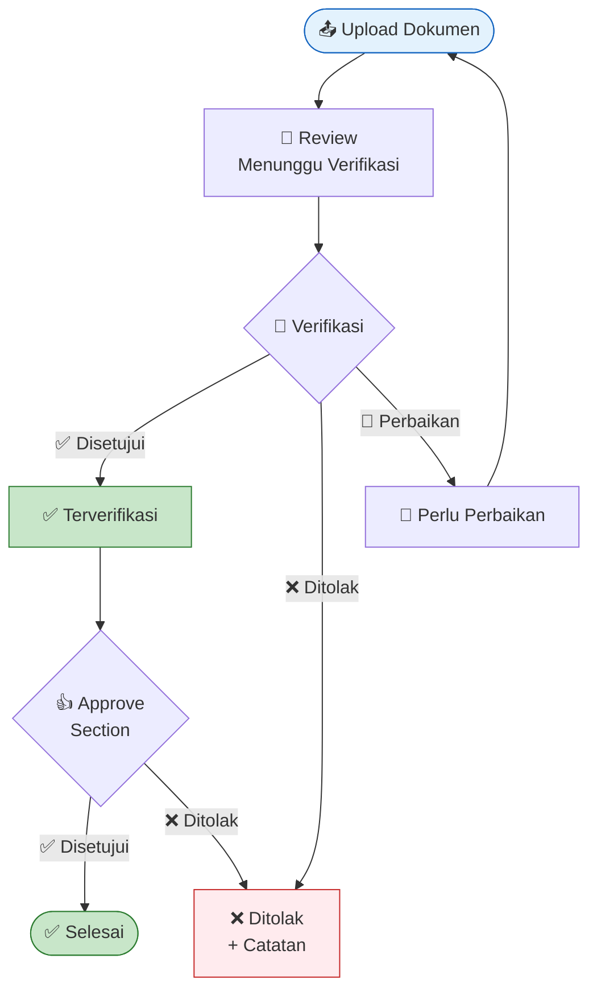

### Approval Board

```mermaid
block-beta
    columns 3
    Section["SECTION"]:1
    Status["STATUS"]:1
    Aksi["AKSI"]:1

    block:sekretariat["Sekretariat"]:3
    sekretariat --> S_Status["✅ Disetujui"]
    sekretariat --> S_Aksi["Setujui | Tolak"]

    block:pemantib["Pemantib"]:3
    pemantib --> P_Status["❌ Belum"]
    pemantib --> P_Aksi["Setujui | Tolak"]

    block:pmd["PMD"]:3
    pmd --> PMD_Status["❌ Belum"]
    pmd --> PMD_Aksi["Setujui | Tolak"]
```

## 7. Database Schema

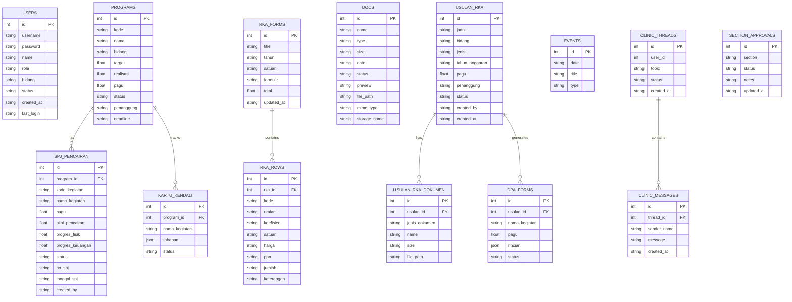

## 8. API Endpoints

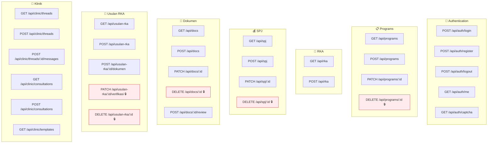

## 9. Menu Sidebar & Navigasi

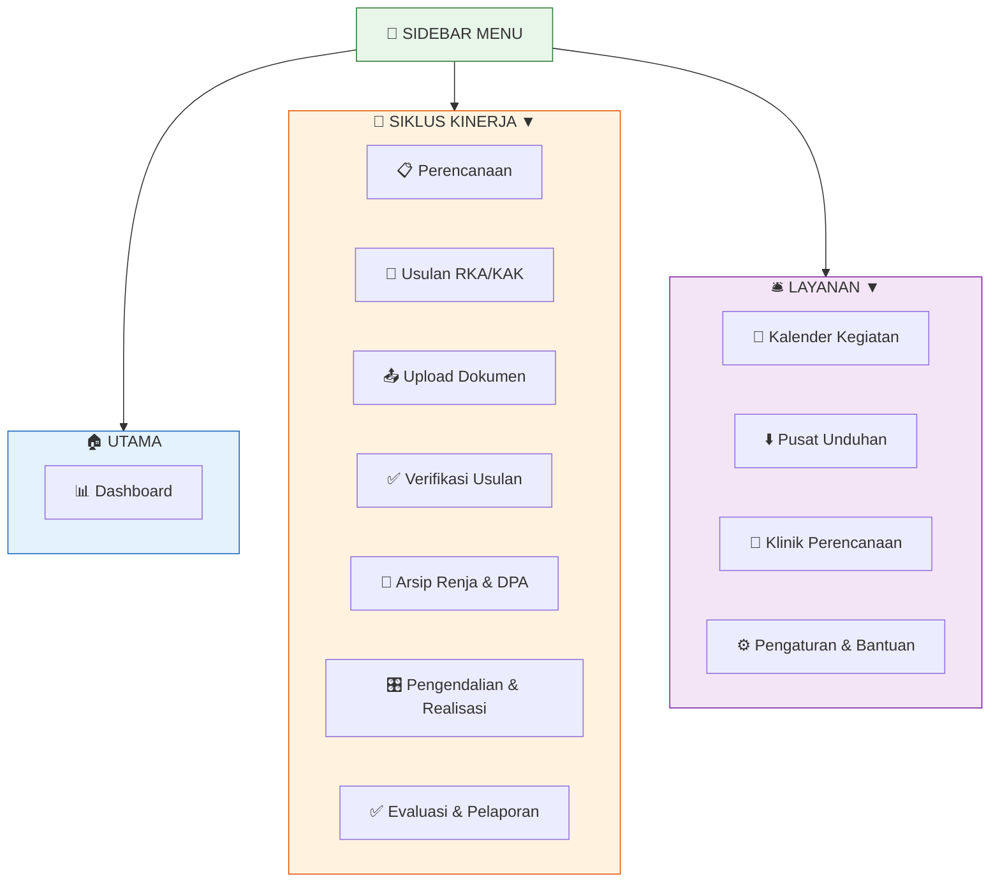

## 10. Export PDF RKA Flow

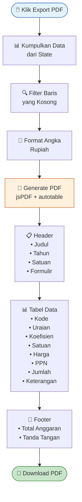

### Contoh Output PDF

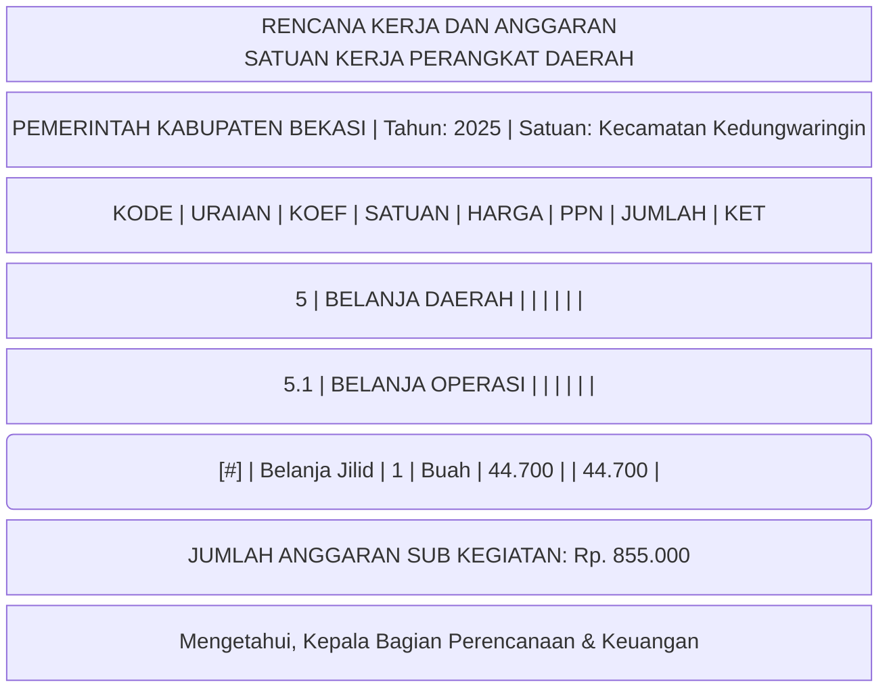

## 11. Matrik Hak Akses

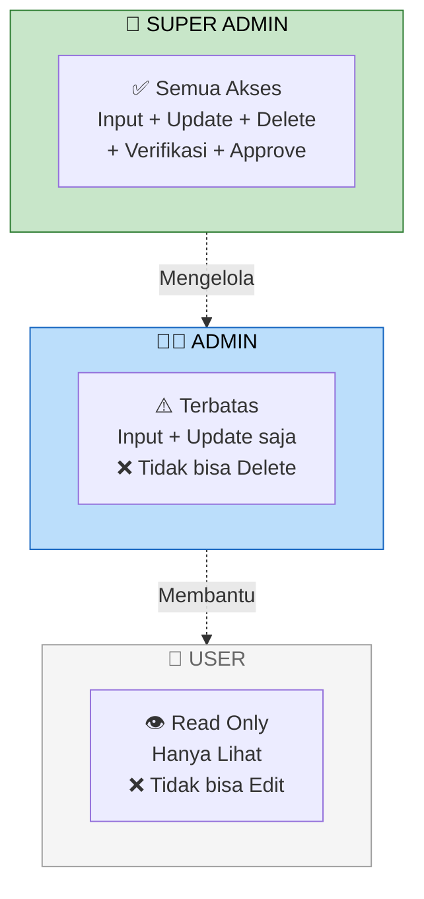

### Detail Matrik

```mermaid
block-beta
    columns 4
    Fitur["FITUR"]:1
    SA["SUPER ADMIN"]:1
    AD["ADMIN"]:1
    US["USER"]:1

    block:header["Header"]:4
    header --> Fitur
    header --> SA
    header --> AD
    header --> US

    block:dashboard["Dashboard"]:4
    dashboard --> F1["Lihat Dashboard"]
    dashboard --> SA1["✅"]
    dashboard --> AD1["✅"]
    dashboard --> US1["✅"]

    block:perencanaan["Perencanaan"]:4
    perencanaan --> F2["Input/Edit"]
    perencanaan --> SA2["✅"]
    perencanaan --> AD2["✅"]
    perencanaan --> US2["❌"]

    block:delete["Delete"]:4
    delete --> F3["Hapus Data"]
    delete --> SA3["✅"]
    delete --> AD3["❌"]
    delete --> US3["❌"]

    block:verifikasi["Verifikasi"]:4
    verifikasi --> F4["Verifikasi"]
    verifikasi --> SA4["✅"]
    verifikasi --> AD4["❌"]
    verifikasi --> US4["❌"]
```

## 12. Arsitektur Aplikasi

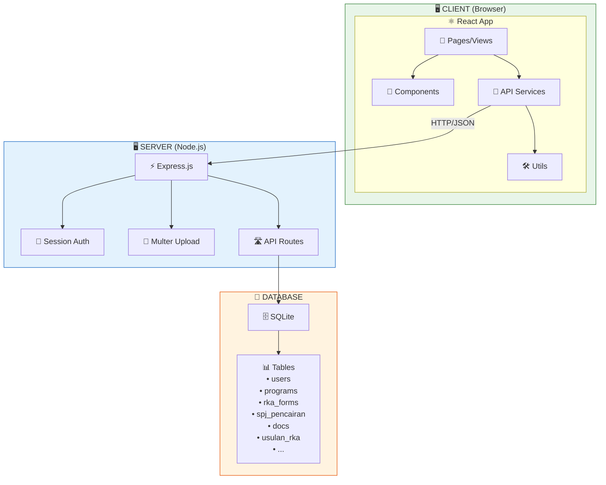

## 13. Alur Login & Autentikasi

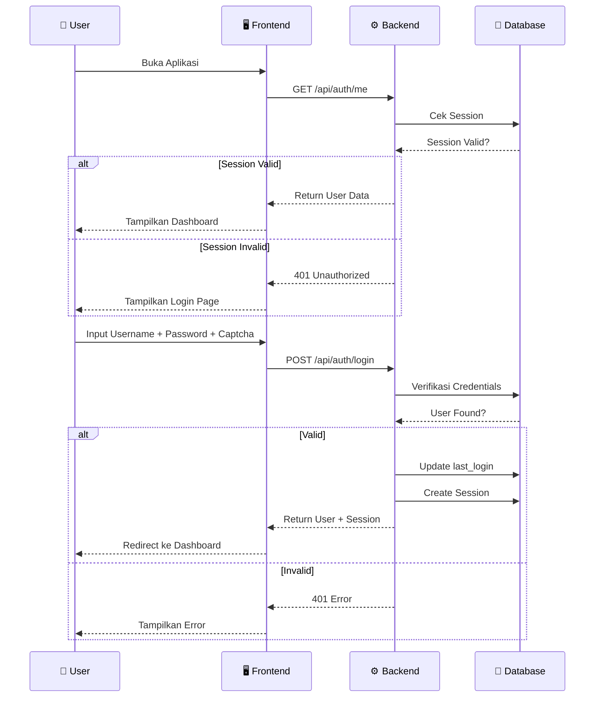

## 14. Multi-Device Responsiveness

```mermaid
graph LR
    subgraph Desktop["🖥️ DESKTOP (> 1050px)"]
        D_Layout["Sidebar Fixed + Content Wide"]
        D_Grid["4 Column Grid"]
        D_Table["Full Table"]
    end

    subgraph Tablet["📱 TABLET (700-1050px)"]
        T_Layout["Sidebar Narrow (220px)"]
        T_Grid["2 Column Grid"]
        T_Table["Scrollable Table"]
    end

    subgraph Mobile["📱 MOBILE (< 700px)"]
        M_Layout["Off-Canvas Sidebar"]
        M_Grid["1-2 Column Grid"]
        M_Table["Horizontal Scroll"]
    end

    Desktop -->|Resize| Tablet
    Tablet -->|Resize| Mobile

    style Desktop fill:#e8f5e9,stroke:#2e7d32
    style Tablet fill:#e3f2fd,stroke:#1565c0
    style Mobile fill:#fff3e0,stroke:#e65100
```

---

## 📋 Ringkasan Login Default

| Role | Username | Password |
|:-----|:---------|:---------|
| Super Admin | `superadmin` | `superadmin123` |
| Admin | `admin` | `admin123` |
| User | `user` | `user123` |
| PPTK | `pptk` | `pptk123` |
| Camat | `camat` | `camat123` |
| Sekcam | `sekcam` | `sekcam123` |

## 🛠️ Tech Stack

| Layer | Technology |
|:------|:-----------|
| Frontend | React 18 + Vite 6 |
| Backend | Express 4 + Node.js 24 |
| Database | SQLite (better-sqlite3) |
| PDF | jsPDF + jspdf-autotable |
| Styling | Custom CSS (CSS Variables) |
| Auth | express-session + scrypt |

---

> **Catatan:** File ini dapat di-render langsung di GitHub atau VS Code dengan extension **Mermaid**. Semua diagram menggunakan syntax Mermaid yang kompatibel dengan GitHub Flavored Markdown.